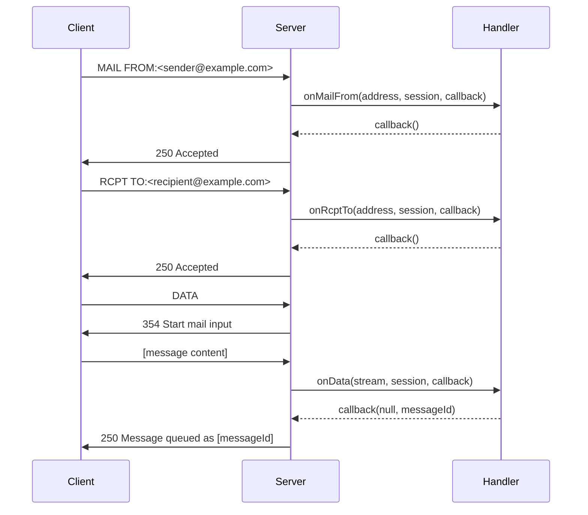

## Overview

Message handling in the SMTP Server involves three main stages:

1. **Envelope validation** - Validating sender and recipients via `onMailFrom` and `onRcptTo`
2. **Message reception** - Receiving message content via `onData`
3. **Response** - Returning success or error to the client

Each stage provides hooks for implementing custom business logic like spam filtering, quota checks, and message storage.

## The Message Flow



## Validating Mail From

The `onMailFrom` handler validates the sender address before accepting the envelope:

### Handler Signature

```javascript
onMailFrom(address, session, callback)
```

### Address Object Structure

```javascript
{
  address: 'sender@example.com',
  args: {
    SIZE: '12345',           // Message size from SIZE parameter
    BODY: '8BITMIME',        // BODY parameter (7BIT or 8BITMIME)
    SMTPUTF8: true,          // UTF-8 support requested
    REQUIRETLS: true,        // TLS required for delivery chain
    RET: 'FULL',            // DSN return type (FULL or HDRS)
    ENVID: 'ABC123'         // DSN envelope ID
  }
}
```

### Implementation Examples

<CodeGroup>
```javascript Accept All
const server = new SMTPServer({
  onMailFrom(address, session, callback) {
    // Accept all senders
    callback();
  }
});
```

```javascript Domain Validation
const server = new SMTPServer({
  onMailFrom(address, session, callback) {
    const allowedDomains = ['example.com', 'trusted.com'];
    const domain = address.address.split('@')[1];
    
    if (allowedDomains.includes(domain)) {
      callback();
    } else {
      const err = new Error('Domain not allowed');
      err.responseCode = 550;
      callback(err);
    }
  }
});
```

```javascript Size Limit Check
const server = new SMTPServer({
  size: 10 * 1024 * 1024, // 10 MB server limit
  
  onMailFrom(address, session, callback) {
    // Check user-specific quota
    const userQuota = getUserQuota(session.user);
    
    if (address.args.SIZE && address.args.SIZE > userQuota) {
      const err = new Error('Message size exceeds your quota');
      err.responseCode = 552;
      return callback(err);
    }
    
    callback();
  }
});
```

```javascript Deny List
const server = new SMTPServer({
  onMailFrom(address, session, callback) {
    if (/^deny/i.test(address.address)) {
      return callback(new Error('Sender address not accepted'));
    }
    callback();
  }
});
```
</CodeGroup>

## Validating Recipients

The `onRcptTo` handler validates each recipient before accepting them:

### Handler Signature

```javascript
onRcptTo(address, session, callback)
```

### Address Object Structure

```javascript
{
  address: 'recipient@example.com',
  args: {
    NOTIFY: 'SUCCESS,FAILURE', // DSN notification conditions
    ORCPT: 'rfc822;original@example.com' // Original recipient
  }
}
```

### Implementation Examples

<CodeGroup>
```javascript Mailbox Validation
const server = new SMTPServer({
  async onRcptTo(address, session, callback) {
    try {
      const exists = await db.mailboxExists(address.address);
      
      if (exists) {
        callback();
      } else {
        const err = new Error('Mailbox does not exist');
        err.responseCode = 550;
        callback(err);
      }
    } catch (err) {
      callback(err);
    }
  }
});
```

```javascript Quota Check
const server = new SMTPServer({
  onRcptTo(address, session, callback) {
    const messageSize = Number(session.envelope.mailFrom.args.SIZE) || 0;
    
    if (address.address.toLowerCase() === 'almost-full@example.com' 
        && messageSize > 100) {
      const err = new Error('Insufficient channel storage: ' + address.address);
      err.responseCode = 452; // Temporary failure
      return callback(err);
    }
    
    callback();
  }
});
```

```javascript Multiple Recipients
const server = new SMTPServer({
  onRcptTo(address, session, callback) {
    // Limit number of recipients
    if (session.envelope.rcptTo.length >= 50) {
      const err = new Error('Too many recipients');
      err.responseCode = 452;
      return callback(err);
    }
    
    callback();
  }
});
```

```javascript Relay Control
const server = new SMTPServer({
  onRcptTo(address, session, callback) {
    const localDomains = ['example.com', 'local.com'];
    const domain = address.address.split('@')[1];
    
    // Allow relay for authenticated users
    if (session.user) {
      return callback();
    }
    
    // Otherwise, only accept local domains
    if (localDomains.includes(domain)) {
      callback();
    } else {
      const err = new Error('Relay access denied');
      err.responseCode = 550;
      callback(err);
    }
  }
});
```
</CodeGroup>

## Handling Message Data

The `onData` handler receives the message content as a readable stream:

### Handler Signature

```javascript
onData(stream, session, callback)
```

### Stream Properties

<ParamField path="stream" type="ReadableStream">
  Readable stream containing the message content.
  
  **Special Properties:**
  - `stream.sizeExceeded` - `true` if message exceeded size limit
</ParamField>

### Implementation Examples

<CodeGroup>
```javascript Save to File
const server = new SMTPServer({
  onData(stream, session, callback) {
    const messageId = generateMessageId();
    const fileName = `./messages/${messageId}.eml`;
    const output = fs.createWriteStream(fileName);
    
    stream.pipe(output);
    
    stream.on('end', () => {
      if (stream.sizeExceeded) {
        const err = new Error('Message exceeds maximum size');
        err.responseCode = 552;
        return callback(err);
      }
      
      callback(null, 'Message queued as ' + messageId);
    });
    
    output.on('error', err => {
      callback(err);
    });
  }
});
```

```javascript Parse and Process
const { simpleParser } = require('mailparser');

const server = new SMTPServer({
  async onData(stream, session, callback) {
    try {
      const parsed = await simpleParser(stream);
      
      // Store message in database
      const messageId = await db.messages.insert({
        from: parsed.from.value[0].address,
        to: parsed.to.value.map(a => a.address),
        subject: parsed.subject,
        text: parsed.text,
        html: parsed.html,
        attachments: parsed.attachments,
        receivedAt: new Date(),
        envelope: session.envelope
      });
      
      callback(null, 'Message accepted: ' + messageId);
    } catch (err) {
      callback(err);
    }
  }
});
```

```javascript Stream to Service
const server = new SMTPServer({
  onData(stream, session, callback) {
    // Stream to S3, cloud storage, etc.
    const upload = s3.upload({
      Bucket: 'mail-storage',
      Key: `${session.id}-${Date.now()}.eml`,
      Body: stream
    });
    
    upload.on('httpUploadProgress', (progress) => {
      console.log('Upload progress:', progress);
    });
    
    upload.send((err, data) => {
      if (err) {
        return callback(err);
      }
      callback(null, 'Message stored at ' + data.Location);
    });
  }
});
```

```javascript Basic Example (from source)
const server = new SMTPServer({
  onData(stream, session, callback) {
    stream.pipe(process.stdout); // Output to console
    
    stream.on('end', () => {
      if (stream.sizeExceeded) {
        const err = new Error('Message exceeds fixed maximum size');
        err.responseCode = 552;
        return callback(err);
      }
      callback(null, 'Message queued as abcdef');
    });
  }
});
```
</CodeGroup>

<Warning>
Always check `stream.sizeExceeded` before accepting the message. The stream will continue even if size limit is exceeded to avoid hanging the connection.
</Warning>

## Accessing Session Data

The `session` object provides context about the current transaction:

```javascript
const server = new SMTPServer({
  onData(stream, session, callback) {
    console.log('Session ID:', session.id);
    console.log('Client IP:', session.remoteAddress);
    console.log('Client hostname:', session.clientHostname);
    console.log('Authenticated user:', session.user);
    console.log('Secure connection:', session.secure);
    console.log('Transmission type:', session.transmissionType);
    
    // Envelope information
    console.log('From:', session.envelope.mailFrom.address);
    console.log('To:', session.envelope.rcptTo.map(r => r.address));
    console.log('Size:', session.envelope.mailFrom.args.SIZE);
    console.log('Body type:', session.envelope.bodyType);
    console.log('UTF-8:', session.envelope.smtpUtf8);
    console.log('Require TLS:', session.envelope.requireTLS);
    
    // DSN parameters (if not hidden)
    if (session.envelope.dsn) {
      console.log('DSN RET:', session.envelope.dsn.ret);
      console.log('DSN ENVID:', session.envelope.dsn.envid);
    }
    
    // Custom data stored in earlier handlers
    console.log('Custom data:', session.customData);
  }
});
```

## Envelope Structure

The session envelope contains all transaction data:

```javascript
session.envelope = {
  mailFrom: {
    address: 'sender@example.com',
    args: {
      SIZE: '12345',
      BODY: '8BITMIME',
      SMTPUTF8: true,
      REQUIRETLS: true,
      RET: 'FULL',
      ENVID: 'ABC123'
    }
  },
  rcptTo: [
    { address: 'recipient1@example.com', args: {} },
    { address: 'recipient2@example.com', args: {} }
  ],
  bodyType: '8BITMIME',  // or '7BIT'
  smtpUtf8: true,        // UTF-8 support
  requireTLS: true,      // TLS required
  dsn: {                 // If DSN not hidden
    ret: 'FULL',         // or 'HDRS'
    envid: 'ABC123'
  }
}
```

## Error Handling

Return appropriate SMTP response codes for different error conditions:

```javascript
const server = new SMTPServer({
  onData(stream, session, callback) {
    // Consume stream even on error
    stream.on('data', () => {});
    
    // Size exceeded (552)
    if (stream.sizeExceeded) {
      const err = new Error('Message too large');
      err.responseCode = 552;
      return callback(err);
    }
    
    // Mailbox full (452 - temporary, or 552 - permanent)
    const err = new Error('Mailbox full');
    err.responseCode = 452; // Temporary failure
    // err.responseCode = 552; // Permanent failure
    
    // Spam detected (550)
    const spamErr = new Error('Message rejected as spam');
    spamErr.responseCode = 550;
    
    // Virus detected (554)
    const virusErr = new Error('Message contains virus');
    virusErr.responseCode = 554;
    
    // Server error (451)
    const serverErr = new Error('Server error, please try again');
    serverErr.responseCode = 451;
  }
});
```

### Common Response Codes

- `250` - Message accepted (success)
- `451` - Temporary failure, try again later
- `452` - Insufficient system storage (temporary)
- `550` - Mailbox unavailable / Rejected
- `552` - Storage allocation exceeded (permanent)
- `554` - Transaction failed

## Complete Example

```javascript
const { SMTPServer } = require('smtp-server');
const { simpleParser } = require('mailparser');
const fs = require('fs');

const server = new SMTPServer({
  size: 10 * 1024 * 1024,
  
  onMailFrom(address, session, callback) {
    // Validate sender
    if (address.address.includes('spam')) {
      const err = new Error('Sender rejected');
      err.responseCode = 550;
      return callback(err);
    }
    callback();
  },
  
  async onRcptTo(address, session, callback) {
    // Validate recipient
    const exists = await checkMailboxExists(address.address);
    if (!exists) {
      const err = new Error('Mailbox not found');
      err.responseCode = 550;
      return callback(err);
    }
    callback();
  },
  
  async onData(stream, session, callback) {
    try {
      // Parse message
      const parsed = await simpleParser(stream);
      
      // Check size
      if (stream.sizeExceeded) {
        throw Object.assign(
          new Error('Message too large'),
          { responseCode: 552 }
        );
      }
      
      // Store message
      const messageId = await saveMessage(parsed, session);
      
      // Send success response
      callback(null, `Message queued as ${messageId}`);
    } catch (err) {
      callback(err);
    }
  }
});

server.listen(2525);
```
