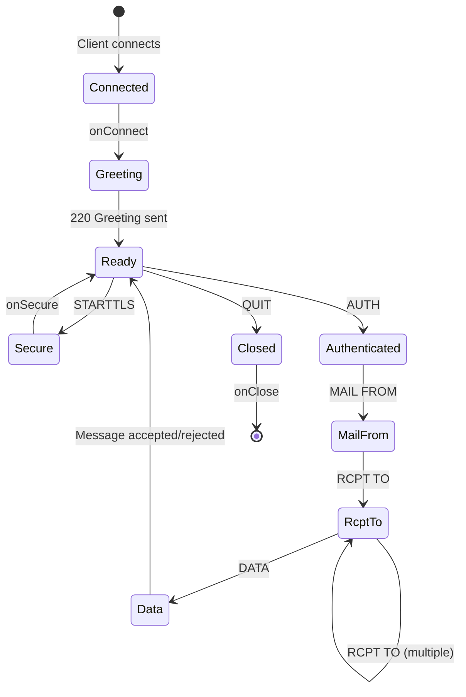

## Overview

Each SMTP connection creates a session object that persists throughout the entire transaction. The session tracks connection state, envelope data, authenticated user, and custom application data.

## Session Lifecycle



## Session Object Structure

The session object is available in all event handlers:

```javascript
session = {
  // Connection identifiers
  id: '8k2j5h3g9f1d0a2b',
  
  // Network information
  remoteAddress: '192.0.2.1',
  remotePort: 54321,
  localAddress: '203.0.113.1',
  localPort: 25,
  clientHostname: 'client.example.com',
  
  // Connection properties
  secure: true,
  tlsOptions: {
    name: 'TLS_AES_256_GCM_SHA384',
    version: 'TLSv1.3'
  },
  
  // Session state
  openingCommand: 'EHLO',
  hostNameAppearsAs: 'client.example.com',
  transmissionType: 'ESMTPSA',
  
  // Authenticated user (set by onAuth)
  user: {
    id: 123,
    email: 'user@example.com'
  },
  
  // Envelope data
  envelope: {
    mailFrom: {
      address: 'sender@example.com',
      args: { SIZE: '12345' }
    },
    rcptTo: [
      { address: 'recipient@example.com', args: {} }
    ],
    bodyType: '8BITMIME',
    smtpUtf8: false,
    requireTLS: false,
    dsn: {
      ret: null,
      envid: null
    }
  },
  
  // Transaction counter
  transaction: 1,
  
  // Proxy data (if using XCLIENT/XFORWARD)
  xClient: Map([
    ['ADDR', '192.0.2.100'],
    ['NAME', 'proxy.example.com']
  ]),
  xForward: Map()
}
```

## Session Properties

### Connection Information

<ParamField path="session.id" type="string">
  Unique session identifier (16-character hexadecimal string).
  
  ```javascript
  console.log(session.id); // "8k2j5h3g9f1d0a2b"
  ```
</ParamField>

<ParamField path="session.remoteAddress" type="string">
  Client IP address (IPv4 or normalized IPv6).
</ParamField>

<ParamField path="session.remotePort" type="number">
  Client port number.
</ParamField>

<ParamField path="session.localAddress" type="string">
  Server IP address.
</ParamField>

<ParamField path="session.localPort" type="number">
  Server port number.
</ParamField>

<ParamField path="session.clientHostname" type="string">
  Reverse DNS hostname for client IP, or `[IP]` if lookup failed.
</ParamField>

### Security Information

<ParamField path="session.secure" type="boolean">
  `true` if connection is using TLS.
</ParamField>

<ParamField path="session.tlsOptions" type="object | false">
  TLS cipher information if connection is secure, otherwise `false`.
  
  ```javascript
  {
    name: 'TLS_AES_256_GCM_SHA384',
    version: 'TLSv1.3'
  }
  ```
</ParamField>

### Session State

<ParamField path="session.openingCommand" type="string">
  The SMTP command used to initiate session: `'HELO'`, `'EHLO'`, or `'LHLO'`.
</ParamField>

<ParamField path="session.hostNameAppearsAs" type="string">
  Hostname provided by client in HELO/EHLO command.
</ParamField>

<ParamField path="session.transmissionType" type="string">
  Protocol type indicator:
  - `SMTP` - Basic SMTP
  - `ESMTP` - Extended SMTP (EHLO)
  - `ESMTPS` - ESMTP over TLS
  - `ESMTPSA` - ESMTP over TLS with authentication
  - `LMTP` - Local Mail Transfer Protocol
  
  <Info>
  The transmission type is built from protocol (SMTP/ESMTP/LMTP) + S (secure) + A (authenticated).
  </Info>
</ParamField>

<ParamField path="session.transaction" type="number">
  Transaction counter (increments for each MAIL FROM in the session).
</ParamField>

### Authentication

<ParamField path="session.user" type="any">
  User data set by `onAuth` handler. Can be any value (user ID, object, etc.).
  
  ```javascript
  // Set by onAuth
  callback(null, {
    user: { id: 123, email: 'user@example.com' }
  });
  
  // Access in other handlers
  console.log(session.user.email);
  ```
</ParamField>

## Event Handlers

### onConnect

Called when a new connection is established, before greeting is sent:

```javascript
const server = new SMTPServer({
  onConnect(session, callback) {
    // Access connection info
    console.log('Connection from', session.remoteAddress);
    
    // Check IP blacklist
    if (isBlacklisted(session.remoteAddress)) {
      const err = new Error('IP address is blacklisted');
      err.responseCode = 554;
      return callback(err);
    }
    
    // Rate limiting
    if (getTooManyConnections(session.remoteAddress)) {
      const err = new Error('Too many connections');
      err.responseCode = 421;
      return callback(err);
    }
    
    // Store custom data in session
    session.connectionTime = new Date();
    
    callback();
  }
});
```

<Note>
The greeting (220) is sent only after `onConnect` completes successfully.
</Note>

### onSecure

Called after TLS upgrade (STARTTLS or implicit TLS):

```javascript
const server = new SMTPServer({
  onSecure(socket, session, callback) {
    // Access TLS information
    console.log('TLS cipher:', socket.getCipher());
    console.log('TLS protocol:', socket.getProtocol());
    console.log('Server name:', socket.servername);
    
    // Verify client certificate if provided
    const cert = socket.getPeerCertificate();
    if (cert && cert.subject) {
      session.clientCert = cert;
      console.log('Client cert:', cert.subject);
    }
    
    callback();
  }
});
```

### onAuth

Handles authentication. See [Authentication](/concepts/authentication) for details.

```javascript
onAuth(auth, session, callback) {
  // Validate credentials and set session.user
  callback(null, { user: userData });
}
```

### onMailFrom

Validates sender address. See [Handling Messages](/concepts/handling-messages) for details.

```javascript
onMailFrom(address, session, callback) {
  // Access previous recipients from this session
  console.log('Transaction #', session.transaction);
  callback();
}
```

### onRcptTo

Validates recipient addresses. See [Handling Messages](/concepts/handling-messages) for details.

```javascript
onRcptTo(address, session, callback) {
  // Check how many recipients already added
  console.log('Recipients so far:', session.envelope.rcptTo.length);
  callback();
}
```

### onData

Handles message content. See [Handling Messages](/concepts/handling-messages) for details.

```javascript
onData(stream, session, callback) {
  // Process message with full session context
  console.log('From:', session.envelope.mailFrom.address);
  console.log('To:', session.envelope.rcptTo.map(r => r.address));
  callback(null, 'Accepted');
}
```

### onClose

Called when connection is closed:

```javascript
const server = new SMTPServer({
  onClose(session) {
    // No callback - runs synchronously
    console.log('Connection closed:', session.id);
    
    // Log session statistics
    logStats({
      id: session.id,
      from: session.remoteAddress,
      user: session.user,
      messages: session.transaction,
      duration: Date.now() - session.connectionTime
    });
    
    // Clean up resources
    cleanupSession(session.id);
  }
});
```

<Info>
`onClose` does not use a callback. Any cleanup should be done synchronously or scheduled asynchronously.
</Info>

## Custom Session Data

You can store custom data in the session object to share between handlers:

```javascript
const server = new SMTPServer({
  onConnect(session, callback) {
    // Initialize custom data
    session.receivedAt = new Date();
    session.messageCount = 0;
    session.customData = {
      tags: [],
      priority: 'normal'
    };
    callback();
  },
  
  onAuth(auth, session, callback) {
    // Add authentication time
    session.authenticatedAt = new Date();
    callback(null, { user: auth.username });
  },
  
  onMailFrom(address, session, callback) {
    // Add spam score
    session.customData.spamScore = calculateSpamScore(address);
    callback();
  },
  
  onData(stream, session, callback) {
    // Access all custom data
    console.log('Session duration:', 
      Date.now() - session.receivedAt.getTime());
    console.log('Spam score:', session.customData.spamScore);
    
    session.messageCount++;
    callback(null, 'Accepted');
  },
  
  onClose(session) {
    console.log('Total messages:', session.messageCount);
  }
});
```

## Proxy Information (XCLIENT/XFORWARD)

When using proxy protocols, original client information is preserved:

```javascript
const server = new SMTPServer({
  useXClient: true,
  useXForward: true,
  
  onConnect(session, callback) {
    // After XCLIENT/XFORWARD, these Maps contain proxy data
    if (session.xClient.has('ADDR')) {
      console.log('Real client IP:', session.xClient.get('ADDR'));
      console.log('Proxy IP:', session.xClient.get('ADDR:DEFAULT'));
    }
    
    if (session.xForward.has('ADDR')) {
      console.log('Forwarded from:', session.xForward.get('ADDR'));
    }
    
    callback();
  }
});
```

### XCLIENT Data

```javascript
session.xClient = Map([
  ['ADDR', '192.0.2.100'],      // Original client IP
  ['ADDR:DEFAULT', '203.0.113.5'], // Proxy IP
  ['NAME', 'client.example.com'],
  ['PORT', 12345],
  ['PROTO', 'SMTP'],
  ['HELO', 'client.example.com'],
  ['LOGIN', 'username']
]);
```

### XFORWARD Data

```javascript
session.xForward = Map([
  ['ADDR', '192.0.2.200'],
  ['NAME', 'forwarded.example.com'],
  ['PORT', 25],
  ['PROTO', 'ESMTP'],
  ['HELO', 'forwarded.example.com'],
  ['IDENT', 'identifier'],
  ['SOURCE', 'REMOTE']
]);
```

## Session Reset (RSET/HELO/EHLO)

The envelope is reset when client sends RSET or HELO/EHLO:

```javascript
// Before RSET
session.envelope = {
  mailFrom: { address: 'sender@example.com' },
  rcptTo: [{ address: 'rcpt@example.com' }]
};

// After RSET - envelope is cleared
session.envelope = {
  mailFrom: false,
  rcptTo: [],
  bodyType: '7bit',
  smtpUtf8: false,
  requireTLS: false
};

// session.user remains intact
// session.transaction is incremented
```

## Complete Session Tracking Example

```javascript
const { SMTPServer } = require('smtp-server');

const server = new SMTPServer({
  logger: true,
  
  onConnect(session, callback) {
    console.log(`[${session.id}] Connected from ${session.remoteAddress}`);
    session.startTime = Date.now();
    callback();
  },
  
  onSecure(socket, session, callback) {
    console.log(`[${session.id}] Upgraded to TLS`);
    session.tlsInfo = socket.getCipher();
    callback();
  },
  
  onAuth(auth, session, callback) {
    console.log(`[${session.id}] Auth attempt: ${auth.username}`);
    callback(null, { user: { email: auth.username } });
  },
  
  onMailFrom(address, session, callback) {
    console.log(`[${session.id}] MAIL FROM: ${address.address}`);
    callback();
  },
  
  onRcptTo(address, session, callback) {
    console.log(`[${session.id}] RCPT TO: ${address.address}`);
    callback();
  },
  
  onData(stream, session, callback) {
    console.log(`[${session.id}] Receiving message...`);
    
    let bytes = 0;
    stream.on('data', chunk => { bytes += chunk.length; });
    stream.on('end', () => {
      console.log(`[${session.id}] Received ${bytes} bytes`);
      callback(null, 'Message accepted');
    });
  },
  
  onClose(session) {
    const duration = Date.now() - session.startTime;
    console.log(`[${session.id}] Closed after ${duration}ms`);
    console.log(`  User: ${session.user?.email || 'none'}`);
    console.log(`  Transactions: ${session.transaction}`);
    console.log(`  Secure: ${session.secure}`);
  }
});

server.listen(2525);
```
